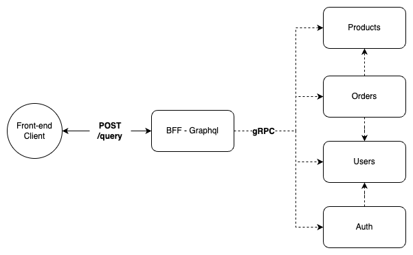

# gRPC + GraphQl + Go Store

Esse projeto busca simular as funcionalidades básicas de uma loja online, contando com criação de usuários, autenticação e autorização, emissão de uma ordem de compra e gereciamento de produtos através de usuário admin.

O objetivo principal foi explorar a linguagem go, aplicando gRPC como ferramenta de comunicação entre serviços, GraphQl para implementação de um bff, servindo então como porta de entrada da aplicação.

## Visão geral 

O diagrama abaixo exemplifica como os serviços se comunicam quando o client realiza uma solicitação através do bff. A fim de explificar, imaginemos a emissão de uma ordem de compra enviada pelo client, o seguinte fluxo irá ocorrer:

1 - O servidor graphql irá se comunicar com o serviço de order através do client gRPC.

2 - O token de autenticação será validado através do interceptor gGRPC

3 - Após a validação do token, o serviço de order consulta o serviço de users e de products (gRPC) a fim de realizar algumas validações, exemplo, verificar se quantidade de produtos da order está disponível em estoque

4 - Validações feitas, o client recebe sua resposta



<sub>Algumas decisões como desacoplar totalmente os módulos, multíplos produtos por order, gerenciamento de secrets e alguns outros foram despriorizados para manter o foco nas tecnologias citadas.</sub>

## Como brincar com isso?

No seu terminal:

```
git clone git@github.com:ruancaetano/grpc-graphql-store.git

docker compose up
```

No seu browser acesse o GraphQl playground através da url `http://localhost:8004/`

Dois usuários devem estar disponíveis 
`ruan@caetano.com/test123` e
`admin@admin.com/teste123`